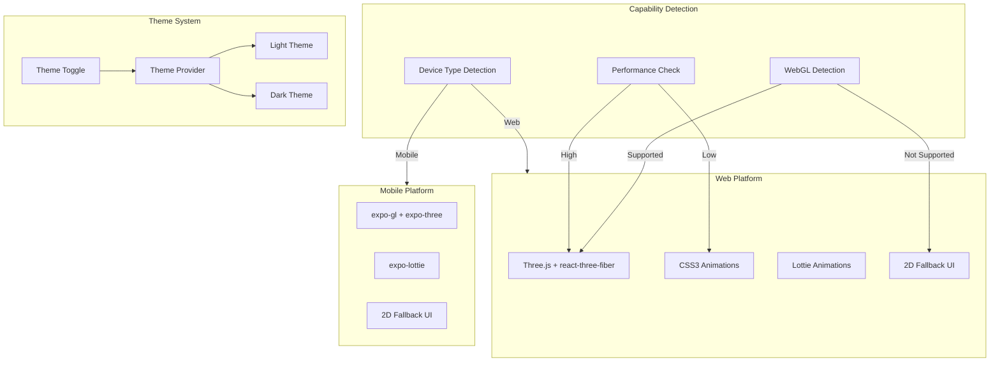

# 3D Animations & Theme System Implementation Plan

## Overview

This plan implements lightweight, interactive 3D animations with graceful fallbacks for older browsers, full Expo mobile support, and a comprehensive eco-friendly theme system with light/dark modes.

## Architecture Overview



## 1. Theme System Implementation

### 1.1 Eco-Friendly Color Palette

**Light Theme Colors:**

- Primary Green: `#22c55e` (emerald-500) - Main eco-action color

- Secondary Green: `#16a34a` (emerald-600) - Hover states

- Accent Blue: `#0ea5e9` (sky-500) - Water/ocean references

- Earth Brown: `#a16207` (amber-700) - Earth/soil references

- Success: `#10b981` (emerald-500) - Positive feedback

- Background: `#f0fdf4` (emerald-50) - Soft green tint

- Surface: `#ffffff` - Clean white surfaces

**Dark Theme Colors:**

- Primary Green: `#4ade80` (emerald-400) - Brighter for dark mode

- Secondary Green: `#22c55e` (emerald-500)

- Accent Blue: `#38bdf8` (sky-400)

- Earth Brown: `#fbbf24` (amber-400)

- Success: `#34d399` (emerald-400)

- Background: `#0f172a` (slate-900) - Deep dark

- Surface: `#1e293b` (slate-800) - Elevated surfaces

### 1.2 Theme System Files

**Create `packages/shared/src/theme/colors.ts`:**

- Define complete color palette with semantic naming

- Export color tokens for both themes

- Include accessibility contrast ratios

**Create `packages/shared/src/theme/theme-provider.tsx`:**

- React context for theme management

- System preference detection

- LocalStorage persistence

- Theme toggle functionality

**Update `apps/web/app/globals.css`:**

- Replace existing CSS variables with eco-friendly palette
- Add dark mode variables

- Include smooth theme transition animations

**Update `apps/web/tailwind.config.js`:**

- Extend theme with eco-friendly colors

- Add custom animation keyframes for eco-themed effects

- Configure dark mode class strategy

**Create `packages/ui/src/components/theme/ThemeToggle.tsx`:**

- Toggle button component

- Icon-based (sun/moon) with smooth transitions

- Accessible with proper ARIA labels

**Create `packages/ui/src/components/theme/ThemeProvider.tsx`:**

- Wrapper component for theme context

- Handles SSR for Next.js

- Provides theme state to children

### 1.3 Mobile Theme Support

**Update `apps/mobile/app/_layout.tsx`:**

- Integrate theme provider

- Use `useColorScheme` from React Native
- Sync with system preferences

**Create `apps/mobile/lib/theme.ts`:**

- React Native theme configuration

- Color mappings for mobile components
- Status bar color management

## 2. 3D Animation System

### 2.1 Capability Detection

**Create `packages/shared/src/utils/capability-detection.ts`:**

- WebGL support detection

- Performance tier detection (high/medium/low)

- Device type detection (mobile/desktop)

- Browser feature detection (CSS3 transforms, etc.)

**Functions:**

- `detectWebGLSupport()`: Check WebGL 1.0/2.0 availability

- `getPerformanceTier()`: Determine device performance level

- `shouldUse3D()`: Decision logic for 3D vs fallback

- `getOptimalRenderStrategy()`: Returns 'threejs' | 'css3d' | 'lottie' | 'fallback'

### 2.2 Web 3D Implementation

**Create `packages/ui/src/components/3d/ThreeScene.tsx`:**

- Main Three.js scene wrapper

- Automatic fallback to 2D if WebGL unavailable

- Performance-optimized render settings

- Lazy loading for 3D assets

**Create `packages/ui/src/components/3d/EcoAvatar.tsx`:**

- 3D avatar progression system

- Level-based model switching

- Lightweight GLTF models (< 500KB each)

- Smooth transitions between levels

**Create `packages/ui/src/components/3d/TrophyRoom.tsx`:**

- 3D gallery for badges/achievements

- Instanced rendering for performance

- Interactive camera controls

- Fallback to 2D grid view

**Create `packages/ui/src/components/3d/ImpactVisualization.tsx`:**

- 3D visualization of environmental impact

- Particle effects for achievements

- Animated transitions

- Performance-optimized with LOD (Level of Detail)

**Create `packages/ui/src/components/3d/Fallback2D.tsx`:**

- 2D fallback component

- CSS3 animations for interactions
- Maintains visual appeal without 3D

- Same functionality, different presentation

### 2.3 Performance Optimization

**Create `packages/ui/src/hooks/use3DOptimization.ts`:**

- Dynamic quality adjustment based on FPS

- Automatic LOD switching

- Asset preloading strategy

- Memory management

**Optimization Strategies:**

- Model compression (GLTF with Draco compression)

- Texture optimization (WebP format, appropriate sizes)

- Instanced rendering for multiple objects

- Frustum culling for off-screen objects

- Render target caching

- Frame rate monitoring and quality adjustment

**Create `packages/ui/src/utils/3d-asset-loader.ts`:**

- Centralized asset loading

- Progress tracking

- Error handling

- Cache management

### 2.4 CSS3 Animation Fallbacks

**Create `packages/ui/src/components/animations/CSS3Animations.tsx`:**

- CSS3-based 3D transforms for simple animations

- Hardware-accelerated transforms

- Fallback for browsers without WebGL

- Smooth 60fps animations

**Animations to implement:**

- Card flip effects

- 3D hover states

- Parallax scrolling

- Transform-based badge reveals

- Particle-like effects using CSS

### 2.5 Lottie Integration

**Install `lottie-react` for web and `expo-lottie` for mobile**

**Create `packages/ui/src/components/animations/LottieAnimation.tsx`:**

- Wrapper for Lottie animations

- Pre-defined eco-themed animations

- Performance-optimized playback

- Auto-play and loop controls

**Lottie animations to create:**

- Achievement unlock celebration

- Points earned animation

- Streak milestone animation

- Lesson completion animation

- Environmental impact visualization

### 2.6 Mobile 3D Implementation

**Create `apps/mobile/components/3d/MobileAvatar.tsx`:**

- Expo GL-based 3D avatar

- Simplified models for mobile performance

- Touch interaction support

- Battery-efficient rendering

**Create `apps/mobile/components/3d/MobileTrophyRoom.tsx`:**

- Mobile-optimized 3D gallery

- Swipe navigation

- Reduced polygon count

- Texture compression

**Update `apps/mobile/package.json`:**

- Ensure `expo-lottie` is installed

- Verify `expo-gl` and `expo-three` versions

**Create `apps/mobile/hooks/useMobile3D.ts`:**

- Mobile-specific 3D optimization

- Battery level monitoring

- Thermal state detection

- Adaptive quality adjustment

## 3. Browser Fallback System

### 3.1 Fallback Detection

**Create `packages/shared/src/utils/browser-detection.ts`:**

- Browser version detection

- Feature support matrix

- Graceful degradation rules

### 3.2 Fallback Components

**Update existing UI components with fallback support:**

**`packages/ui/src/components/gamification/BadgeCollection.tsx`:**

- Add 3D mode with fallback to 2D grid

- CSS3 hover effects as fallback

- Maintain functionality regardless of 3D support

**`packages/ui/src/components/gamification/PointsDisplay.tsx`:**

- Add animated 3D number reveal

- Fallback to CSS3 animation

- Final fallback to static display

**`packages/ui/src/components/gamification/StreakCounter.tsx`:**

- 3D flame animation with fallback

- CSS3 pulse animation

- Static display for lowest tier

### 3.3 Progressive Enhancement Strategy

**Implementation approach:**

1. Start with functional 2D UI (works everywhere)

2. Enhance with CSS3 animations (modern browsers)

3. Add Lottie animations (better performance)

4. Upgrade to Three.js 3D (high-end devices)

**Create `packages/ui/src/components/common/ProgressiveEnhancement.tsx`:**

- Wrapper component for progressive enhancement

- Automatic feature detection

- Seamless fallback chain

## 4. Integration Points

### 4.1 Web App Integration

**Update `apps/web/app/layout.tsx`:**

- Add ThemeProvider wrapper

- Include capability detection

- Set up 3D asset preloading

**Update `apps/web/app/page.tsx`:**

- Integrate 3D avatar display

- Add theme-aware styling

- Include fallback handling

**Create `apps/web/lib/3d-config.ts`:**

- Web-specific 3D configuration

- Performance thresholds

- Asset paths

### 4.2 Mobile App Integration

**Update `apps/mobile/app/_layout.tsx`:**

- Add theme provider

- Configure 3D capabilities

- Set up mobile optimizations

**Create `apps/mobile/lib/3d-config.ts`:**

- Mobile-specific 3D configuration

- Device-specific quality settings

- Battery optimization rules

### 4.3 Shared Package Updates

**Update `packages/shared/src/types/index.ts`:**

- Add theme type definitions

- Add 3D capability types

- Add animation configuration types

**Create `packages/shared/src/constants/theme.ts`:**

- Theme-related constants

- Color mappings

- Animation durations

## 5. Asset Management

### 5.1 3D Model Assets

**Model requirements:**

- Avatar models: < 500KB each (compressed GLTF)
- Trophy models: < 200KB each

- Environment models: < 1MB total

- Use Draco compression for all models

**Asset structure:**

```javascript
apps/web/public/3d-models/
├── avatars/
│   ├── seed.glb
│   ├── sapling.glb
│   ├── tree.glb
│   └── guardian.glb
├── trophies/
│   ├── badge-common.glb
│   ├── badge-rare.glb
│   └── badge-legendary.glb
└── environments/
    └── trophy-room.glb
```

### 5.2 Lottie Animation Assets

**Animation requirements:**

- File size: < 100KB each

- Frame rate: 30fps (balance quality/performance)

- Loop optimization

**Animation structure:**

```javascript
apps/web/public/animations/
├── achievement-unlock.json
├── points-earned.json
├── streak-milestone.json
└── lesson-complete.json
```

## 6. Performance Monitoring

### 6.1 Performance Metrics

**Create `packages/shared/src/utils/performance-monitor.ts`:**

- FPS monitoring

- Memory usage tracking

- Render time measurement

- Quality adjustment triggers

### 6.2 Analytics Integration

**Track:**

- 3D capability detection results
- Fallback usage statistics

- Performance tier distribution

- Theme preference analytics

## 7. Playwright Testing Strategy

### 7.1 Playwright Setup & Configuration

**Install Playwright:**

- Add `@playwright/test` to root `package.json` devDependencies
- Version: ^1.41.2 (already in pnpm-lock.yaml)
- Install browsers: `npx playwright install`

**Create `playwright.config.ts` in root:**

- Configure multi-browser testing (Chromium, Firefox, WebKit)
- Set up multiple viewport sizes (desktop, tablet, mobile)
- Configure test timeouts and retries
- Set up base URL for local development
- Configure screenshot and video recording
- Set up test parallelization

**Create `tests/e2e/playwright.config.ts`:**

- E2E-specific configuration
- Test fixtures for authentication
- Custom test utilities
- Page object model setup

### 7.2 Test File Structure

**Create test directory structure:**

```
tests/
├── e2e/
│   ├── fixtures/
│   │   ├── auth.setup.ts
│   │   └── test-utils.ts
│   ├── theme/
│   │   ├── theme-switching.spec.ts
│   │   ├── theme-persistence.spec.ts
│   │   └── theme-visual-regression.spec.ts
│   ├── 3d/
│   │   ├── webgl-detection.spec.ts
│   │   ├── 3d-fallback.spec.ts
│   │   ├── avatar-progression.spec.ts
│   │   ├── trophy-room.spec.ts
│   │   └── performance.spec.ts
│   ├── animations/
│   │   ├── lottie-animations.spec.ts
│   │   ├── css3-animations.spec.ts
│   │   └── animation-performance.spec.ts
│   ├── components/
│   │   ├── badge-collection.spec.ts
│   │   ├── points-display.spec.ts
│   │   └── streak-counter.spec.ts
│   └── accessibility/
│       ├── theme-a11y.spec.ts
│       ├── keyboard-navigation.spec.ts
│       └── screen-reader.spec.ts
├── visual/
│   ├── theme-comparison.spec.ts
│   ├── 3d-vs-fallback.spec.ts
│   └── component-regression.spec.ts
└── performance/
    ├── load-time.spec.ts
    ├── fps-monitoring.spec.ts
    └── memory-usage.spec.ts
```

### 7.3 Theme System Tests

**Create `tests/e2e/theme/theme-switching.spec.ts`:**

- Test theme toggle button functionality
- Verify light/dark mode switching
- Test system preference detection
- Verify theme persistence in localStorage
- Test theme switching across page navigation
- Verify smooth transitions between themes

**Create `tests/e2e/theme/theme-persistence.spec.ts`:**

- Test theme persistence across browser sessions
- Verify localStorage storage/retrieval
- Test theme sync across tabs
- Verify theme reset functionality

**Create `tests/e2e/theme/theme-visual-regression.spec.ts`:**

- Screenshot comparisons for light theme
- Screenshot comparisons for dark theme
- Component-level visual tests
- Full page visual regression tests
- Cross-browser visual consistency

### 7.4 3D Capability & Fallback Tests

**Create `tests/e2e/3d/webgl-detection.spec.ts`:**

- Test WebGL support detection
- Verify capability detection logic
- Test performance tier detection
- Verify device type detection
- Test optimal render strategy selection

**Create `tests/e2e/3d/3d-fallback.spec.ts`:**

- Test 3D component with WebGL enabled
- Test fallback to 2D when WebGL disabled
- Test CSS3 animation fallback
- Test Lottie animation fallback
- Verify functionality maintained in all modes
- Test progressive enhancement chain

**Create `tests/e2e/3d/avatar-progression.spec.ts`:**

- Test avatar level progression
- Verify model switching at different levels
- Test smooth transitions between levels
- Verify fallback avatar display
- Test touch/mouse interactions

**Create `tests/e2e/3d/trophy-room.spec.ts`:**

- Test 3D trophy room rendering
- Verify camera controls (orbit, zoom, pan)
- Test badge display in 3D gallery
- Verify fallback to 2D grid view
- Test interactive badge selection

**Create `tests/e2e/3d/performance.spec.ts`:**

- Measure 3D scene load time
- Monitor FPS during animations
- Test performance on different device profiles
- Verify quality adjustment triggers
- Test memory usage over time

### 7.5 Animation Tests

**Create `tests/e2e/animations/lottie-animations.spec.ts`:**

- Test Lottie animation playback
- Verify animation completion
- Test loop functionality
- Verify animation performance
- Test animation error handling

**Create `tests/e2e/animations/css3-animations.spec.ts`:**

- Test CSS3 3D transforms
- Verify hardware acceleration
- Test animation smoothness (60fps)
- Verify fallback animations work

**Create `tests/e2e/animations/animation-performance.spec.ts`:**

- Measure animation frame rates
- Test animation impact on page performance
- Verify animations don't block UI
- Test concurrent animations

### 7.6 Component Integration Tests

**Create `tests/e2e/components/badge-collection.spec.ts`:**

- Test badge collection in 3D mode
- Test badge collection in 2D fallback
- Verify badge unlock animations
- Test badge interaction
- Verify accessibility in both modes

**Create `tests/e2e/components/points-display.spec.ts`:**

- Test points display with 3D animation
- Test points display with CSS3 fallback
- Test points display static fallback
- Verify points update animations
- Test number formatting

**Create `tests/e2e/components/streak-counter.spec.ts`:**

- Test streak counter 3D flame animation
- Test streak counter CSS3 pulse
- Test streak counter static display
- Verify streak milestone celebrations
- Test streak reset handling

### 7.7 Visual Regression Testing

**Create `tests/visual/theme-comparison.spec.ts`:**

- Full page screenshots in light theme
- Full page screenshots in dark theme
- Component-level theme comparisons
- Cross-browser visual consistency
- Responsive design visual tests

**Create `tests/visual/3d-vs-fallback.spec.ts`:**

- Screenshot 3D components
- Screenshot 2D fallback components
- Compare visual appearance
- Verify functional equivalence
- Test visual consistency

**Create `tests/visual/component-regression.spec.ts`:**

- Screenshot all major components
- Track visual changes over time
- Detect unintended visual regressions
- Test responsive breakpoints
- Verify theme-specific styling

### 7.8 Performance Testing

**Create `tests/performance/load-time.spec.ts`:**

- Measure initial page load time
- Test 3D asset loading time
- Measure theme switching time
- Test lazy loading performance
- Verify performance budgets

**Create `tests/performance/fps-monitoring.spec.ts`:**

- Monitor FPS during 3D animations
- Test FPS on different devices
- Verify 60fps target on capable devices
- Test FPS degradation handling
- Monitor FPS over extended periods

**Create `tests/performance/memory-usage.spec.ts`:**

- Track memory usage with 3D scenes
- Test memory leaks
- Verify garbage collection
- Test memory usage on low-end devices
- Monitor memory over time

### 7.9 Accessibility Tests

**Create `tests/e2e/accessibility/theme-a11y.spec.ts`:**

- Test color contrast ratios (WCAG AA)
- Verify theme switching with screen readers
- Test focus indicators in both themes
- Verify readable text in all themes

**Create `tests/e2e/accessibility/keyboard-navigation.spec.ts`:**

- Test keyboard navigation in 3D components
- Test keyboard navigation in fallback mode
- Verify focus management
- Test keyboard shortcuts
- Verify tab order

**Create `tests/e2e/accessibility/screen-reader.spec.ts`:**

- Test with screen reader (NVDA/JAWS)
- Verify ARIA labels
- Test semantic HTML structure
- Verify announcements for theme changes
- Test 3D component descriptions

### 7.10 Cross-Browser Testing

**Browser Matrix:**

- Chromium (Chrome, Edge)
- Firefox
- WebKit (Safari)
- Mobile browsers (Chrome Mobile, Safari Mobile)

**Device Profiles:**

- Desktop (1920x1080, 2560x1440)
- Tablet (768x1024, 1024x768)
- Mobile (375x667, 414x896)

**Test Scenarios:**

- Modern browser with full WebGL support
- Older browser with limited WebGL
- Browser without WebGL (fallback testing)
- Different viewport sizes
- Touch vs mouse interactions

### 7.11 Test Utilities & Helpers

**Create `tests/e2e/fixtures/test-utils.ts`:**

- Helper functions for common test operations
- Theme switching utilities
- 3D capability mocking
- Performance measurement helpers
- Screenshot comparison utilities

**Create `tests/e2e/fixtures/auth.setup.ts`:**

- Authentication setup for tests
- User session management
- Test user creation/cleanup
- Firebase emulator integration

### 7.12 CI/CD Integration

**Update `.github/workflows/ci.yml`:**

- Add Playwright test step
- Run tests on multiple browsers
- Generate test reports
- Upload test artifacts (screenshots, videos)
- Fail build on test failures
- Visual regression test integration

**Test Execution:**

- Run tests on every PR
- Run full test suite on main branch
- Run smoke tests on every commit
- Run visual regression on schedule
- Performance tests on release candidates

### 7.13 Test Data & Mocking

**Create `tests/e2e/mocks/`:**

- Mock 3D models for testing
- Mock WebGL contexts
- Mock performance APIs
- Mock device capabilities
- Mock theme system

**Test Data:**

- Sample user profiles
- Test badges and achievements
- Test points and streaks
- Test theme preferences

## 8. Implementation Order

### Phase 1: Theme System (Week 1)

1. Create theme color palette

2. Implement theme provider

3. Update Tailwind config

4. Create theme toggle component

5. Test light/dark mode switching

### Phase 2: Capability Detection (Week 1-2)

1. Implement browser/device detection

2. Create performance tier detection

3. Build fallback decision logic

4. Test across various browsers/devices

### Phase 3: 3D Foundation (Week 2)

1. Set up Three.js scene wrapper

2. Implement WebGL detection

3. Create fallback components

4. Basic 3D asset loading

### Phase 4: 3D Components (Week 2-3)

1. Build EcoAvatar component

2. Create TrophyRoom component

3. Implement ImpactVisualization

4. Add CSS3 animation fallbacks

### Phase 5: Mobile 3D (Week 3)

1. Set up Expo GL integration

2. Create mobile-optimized 3D components

3. Implement battery/thermal monitoring

4. Test on various mobile devices

### Phase 6: Lottie Integration (Week 3-4)

1. Integrate Lottie for web

2. Integrate expo-lottie for mobile

3. Create eco-themed animations

4. Optimize animation files

### Phase 7: Performance Optimization (Week 4)

1. Implement dynamic quality adjustment

2. Add asset compression

3. Optimize render settings

4. Performance testing and tuning

### Phase 8: Playwright Testing Setup (Week 4)

1. Install and configure Playwright

2. Set up test infrastructure

3. Create test fixtures and utilities

4. Write initial test suites

5. Set up CI/CD integration

### Phase 9: Integration & Testing (Week 4-5)

1. Integrate 3D into existing components

2. Write comprehensive Playwright tests

3. Test fallback scenarios across browsers

4. Visual regression testing

5. Performance benchmarking

6. Accessibility testing

7. Cross-browser validation

## 9. File Structure

```javascript
packages/
├── shared/
│   └── src/
│       ├── theme/
│       │   ├── colors.ts
│       │   ├── theme-provider.tsx
│       │   └── constants.ts
│       └── utils/
│           ├── capability-detection.ts
│           ├── browser-detection.ts
│           └── performance-monitor.ts
└── ui/
    └── src/
        ├── components/
        │   ├── theme/
        │   │   ├── ThemeProvider.tsx
        │   │   └── ThemeToggle.tsx
        │   ├── 3d/
        │   │   ├── ThreeScene.tsx
        │   │   ├── EcoAvatar.tsx
        │   │   ├── TrophyRoom.tsx
        │   │   ├── ImpactVisualization.tsx
        │   │   └── Fallback2D.tsx
        │   └── animations/
        │       ├── CSS3Animations.tsx
        │       └── LottieAnimation.tsx
        ├── hooks/
        │   ├── use3DOptimization.ts
        │   └── useTheme.ts
        └── utils/
            └── 3d-asset-loader.ts

apps/
├── web/
│   ├── app/
│   │   └── layout.tsx (update with ThemeProvider)
│   ├── lib/
│   │   └── 3d-config.ts
│   └── public/
│       ├── 3d-models/
│       └── animations/
└── mobile/
    ├── app/
    │   └── _layout.tsx (update with theme)
    ├── components/
    │   └── 3d/
    │       ├── MobileAvatar.tsx
    │       └── MobileTrophyRoom.tsx
    ├── hooks/
    │   └── useMobile3D.ts
    └── lib/
        ├── theme.ts
        └── 3d-config.ts

tests/
├── e2e/
│   ├── fixtures/
│   │   ├── auth.setup.ts
│   │   └── test-utils.ts
│   ├── theme/
│   │   ├── theme-switching.spec.ts
│   │   ├── theme-persistence.spec.ts
│   │   └── theme-visual-regression.spec.ts
│   ├── 3d/
│   │   ├── webgl-detection.spec.ts
│   │   ├── 3d-fallback.spec.ts
│   │   ├── avatar-progression.spec.ts
│   │   ├── trophy-room.spec.ts
│   │   └── performance.spec.ts
│   ├── animations/
│   │   ├── lottie-animations.spec.ts
│   │   ├── css3-animations.spec.ts
│   │   └── animation-performance.spec.ts
│   ├── components/
│   │   ├── badge-collection.spec.ts
│   │   ├── points-display.spec.ts
│   │   └── streak-counter.spec.ts
│   └── accessibility/
│       ├── theme-a11y.spec.ts
│       ├── keyboard-navigation.spec.ts
│       └── screen-reader.spec.ts
├── visual/
│   ├── theme-comparison.spec.ts
│   ├── 3d-vs-fallback.spec.ts
│   └── component-regression.spec.ts
└── performance/
    ├── load-time.spec.ts
    ├── fps-monitoring.spec.ts
    └── memory-usage.spec.ts
```

## 10. Dependencies to Add

**Web:**

- `lottie-react`: ^2.4.0 (Lottie animations)

- `next-themes`: ^0.2.1 (Theme management for Next.js)

**Mobile:**

- `expo-lottie`: ~6.0.0 (Lottie for Expo)

- `react-native-reanimated`: ~3.6.0 (Advanced animations)

**Testing:**

- `@playwright/test`: ^1.41.2 (E2E testing - already in pnpm-lock.yaml)

- `@axe-core/playwright`: ^4.8.0 (Accessibility testing)

- `playwright`: ^1.41.2 (Playwright CLI)

**Shared:**

- No new dependencies (use existing Three.js, Zustand)

## 11. Test Scripts Configuration

**Update root `package.json` scripts:**

```json
{
  "scripts": {
    "test:e2e": "playwright test",
    "test:e2e:ui": "playwright test --ui",
    "test:e2e:debug": "playwright test --debug",
    "test:visual": "playwright test tests/visual",
    "test:performance": "playwright test tests/performance",
    "test:accessibility": "playwright test tests/e2e/accessibility",
    "test:3d": "playwright test tests/e2e/3d",
    "test:theme": "playwright test tests/e2e/theme",
    "test:all": "playwright test --reporter=html",
    "test:update-snapshots": "playwright test --update-snapshots",
    "test:report": "playwright show-report"
  }
}
```

**Test Execution Commands:**

- `pnpm test:e2e` - Run all E2E tests
- `pnpm test:e2e:ui` - Run tests with Playwright UI mode
- `pnpm test:visual` - Run visual regression tests
- `pnpm test:performance` - Run performance tests
- `pnpm test:accessibility` - Run accessibility tests
- `pnpm test:3d` - Run 3D-specific tests
- `pnpm test:theme` - Run theme-specific tests

## 12. Success Criteria

**Functionality:**

- Theme system works seamlessly across web and mobile
- 3D animations run at 60fps on capable devices
- Graceful fallbacks work on all browsers (including IE11)
- Mobile 3D performs well without excessive battery drain
- Performance tier detection accurately adjusts quality
- All components maintain functionality in fallback mode
- Theme switching is instant and smooth
- Color contrast meets accessibility standards
- Bundle size increase is minimal (< 200KB for 3D assets)

**Testing Coverage:**

- 90%+ test coverage for critical 3D and theme functionality
- All E2E test suites passing on all browsers
- Visual regression tests passing with < 1% false positives
- Performance tests meeting all benchmarks
- Accessibility tests passing WCAG AA standards
- Cross-browser compatibility verified (Chrome, Firefox, Safari, Edge)
- Mobile device testing completed on iOS and Android
- CI/CD pipeline running tests automatically on every PR

## 13. Risk Mitigation

**Performance concerns:**

- Implement aggressive LOD system

- Use texture compression

- Monitor and adjust quality dynamically

**Browser compatibility:**

- Comprehensive fallback testing

- Progressive enhancement approach

- Feature detection before 3D initialization

**Mobile battery drain:**

- Thermal state monitoring

- Battery level checks

- Automatic quality reduction on low battery

**Bundle size:**

- Lazy load 3D assets
- Code splitting for 3D components